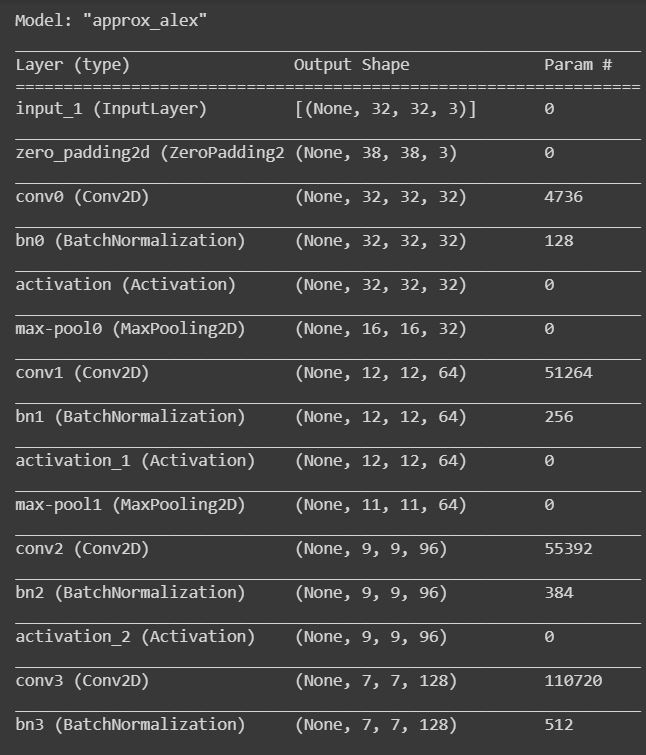

# ApproxAlex-on-Keras
Tried to implement Alexnet from Scratch on Keras

AlexNet is an Influential paper published in computer vision, employing CNNs and GPUs to accelerate deep learning. As of 2020, the AlexNet paper has been cited over 61015 times according to the author’s Google Scholar profile.

AlexNet, A large margin winner of the ILSRVC-2012. The network demonstrated the potential of training large neural networks quickly on massive datasets using widely available gaming GPUs.

| Type | Accuracy |
|-------|----------|
| Train | 97.49 |
| Test  | 75.65 |

Here we define a model architecture of AlexNet.

As you can see, batch Normalization is used after each convolution layer instead of Local response Normalization.
The dropout layer is not added but given in the comment section at Two Fully connected layers, So that if you want you can tweak it.
The parameters like strides and kernel size are tweaked a little bit, however the number of kernels kept the same as that of AlexNet.


Model Summary:




### Dataset

We load the CIFAR-10 dataset using the Keras library. The Keras library has a suite of datasets readily available for use with easy accessibility.


### Procedure
Install the dependencies and devDependencies and start running .py file.

```sh
$ cd Lenet5-from-scratch
$ python lenet5.py
```

### Todos

 - Add Keras Tuner

### Development

Want to contribute? Great!
You can [contact](mailto:shubhpachchigar@gmail.com) me for any suggestion or feedback!


License
----

MIT

